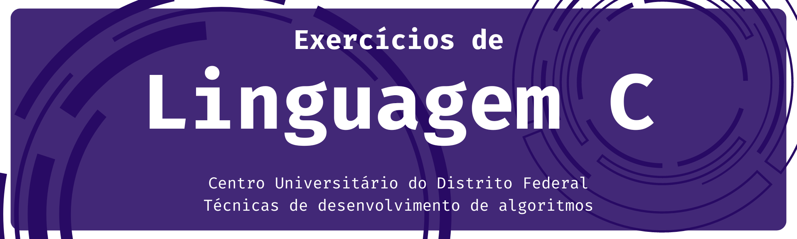

# Para Executar

Utilizei o GCC para compilar e rodar o programa em terminal (escrevi o código no VSCODE), mas você pode utilizar IDEs dedicadas para código em C sem problemas, como o **CLION**, **DEVC++** ou **Code::Blocks**, .
- **Dica:** estudantes podem baixar as IDEs da **JetBrains** gratuitamente, vale a pena conhecer.

### Execute o programa com o comando abaixo

```bash
gcc listaExerciciosProfaFlavia.c -o listaExerciciosProfaFlavia && ./listaExerciciosProfaFlavia
```
### Sobre o programa
- Esse programa foi desenvolvido para resolver a lista de exercícios das aulas da professora Flávia, minha tutora da disciplina de *Técnicas de Desenvolvimento de Algoritmos* na UDF.
- Eu decidi versionar o código da resolução da lista para que seja possível ser consultado pelos outros alunos que podem possuir alguma dificuldade.

**BONS ESTUDOS PARA TODOS NÓS!**